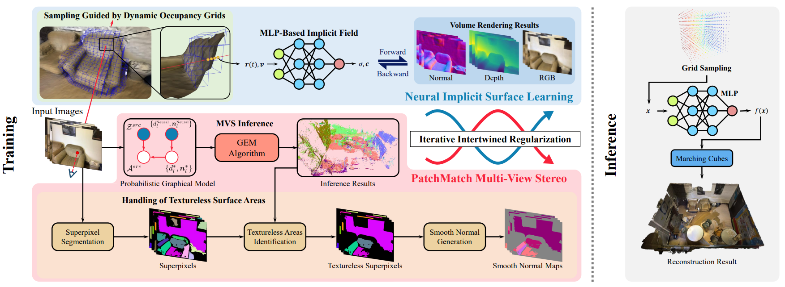

# <p align="center"> HelixSurf: A Robust and Efficient Neural Implicit Surface Learning of Indoor Scenes with Iterative Intertwined Regularization </p>

#####  <p align="center"> [Zhihao Liang](https://lzhnb.github.io/), [Zhangjin Huang](https://scholar.google.com/citations?hl=zh-CN&user=AkmhptgAAAAJ), [Changxing Ding](https://www2.scut.edu.cn/ft/2021/1102/c29779a449569/page.htm), [Kui Jia](http://kuijia.site/) </p>

#### <p align="center"> CVPR 2023 </p>

#### <p align="center">[Paper](https://arxiv.org/pdf/2302.14340.pdf) | [Arxiv](https://arxiv.org/abs/2302.14340) | [Project Page](https://lzhnb.github.io/project-pages/helixsurf.html) </p>

<p align="center">
  
</p>

## Requirements
- Python 3.8.13
- PyTorch 1.11.0+cu113
- CUDA 11.3
- [Prim3D](https://github.com/lzhnb/Primitive3D) for efficient `RayCasting` and `MarchingCubes`
- [gmvs](https://github.com/Gorilla-Lab-SCUT/gmvs) for efficient PatchMatch MVS
```sh
pip install -r requirements.txt
```

## Installation
```sh
git submodule update --init --recursive
python setup.py develop
```

> `Prim3D` and `gmvs` can be obtained from submodules. Please follow their `README.md` and install them.


## Training
> take `0616_00` in ScanNet as an example

- step0: Download our processed data from [[Google Drive]](https://drive.google.com/file/d/194mwQX--tDRfJBlTKaHM3W0-EPDx0nrt/view?usp=sharing) [[Baidu Cloud]](https://pan.baidu.com/s/1XiFptOd18tHtm4LodR8Qgw)（提取码：a6sa），unzip `HelixSurf_data.zip` as `HelixSurf_data` under the project root directory.

```sh
HelixSurf_data
  ├── scene_data # stores our processed data
  └── mvs_results # stores our MVS results
```

> for custom data, please refer to [ManhattanSDF](https://github.com/zju3dv/manhattan_sdf/tree/main/docs/run_colmap) to generate data.

- step1 (Optional): Fix the parameters in `run_scripts/first_mvs.sh` and run the follow command to perform mvs:

> you can also use the our mvs results from `HelixSurf_data/mvs_results` and skip this step

```sh
sh run_scripts/first_mvs.sh
```

- step2: Train the first epoch

```sh
sh run_scripts/0616_train.sh mvs "--casting"
```

- step3: Perform the second mvs

```sh
sh run_scripts/next_mvs.sh
```

- step4: Train the second epoch

```sh
sh run_scripts/0616_train.sh mvs_from_1epoch "--load_ckpt ckpt/0616_00_default/ckpt_1.pth --consistant -im_psize 11"
```

## Training using pretrained geometric cues
> take `0616_00` in ScanNet as an example
> we provide the run_script for `0616_00`. You can just modify this script slightly and get the training launch script for other scene.
> You can also refer MonoSDF to generate geometric cues using Omnidata.
> The 

- step0: prepare original data
- step1: generate geometric cues (just for normal)
```sh
python scripts/pretrained_geometric.py --task normal \
  --img_path HelixSurf_data/scene_data/0616_00/images/ \
  --output_path HelixSurf_data/scene_data/0616_00/pretrained \
  --omnidata_path $OMNIDATA_PROJECT/omnidata_tools/torch \
  --pretrained_models $OMNIDATA_PROJECT/omnidata_tools/torch/pretrained_models/
```
- step2: training

```sh
sh run_scripts/0616_pretrained_train.sh mvs "--casting"
```

## Inference

Run the follow command to perform inference:

```sh
python scripts/inference.py --config configs/default.yaml --data_dir $DATA_DIR --scene 0616_00 --ckpt $CKPT_PATH
```

We provide pretrained models. [[Google Drive]](https://drive.google.com/drive/folders/18L4idm4nD5JYPswWz05Z9oiaLUm6q5uV?usp=sharing) [[Baidu Cloud]](https://pan.baidu.com/s/1zQ2J0fXFKF5x_K9C_yDaOg)（提取码：yil8）.

## TODO

- [x] Pretrained model support (normal cues)
- [ ] Unbiased depth expectation for regularization

## Acknowledge

- [Plenoxel](https://github.com/sxyu/svox2)
- [NeuS](https://github.com/Totoro97/NeuS)


## Citation
If you find this work useful in your research, please cite:
```txt
@misc{liang2023helixsurf,
      title={HelixSurf: A Robust and Efficient Neural Implicit Surface Learning of Indoor Scenes with Iterative Intertwined Regularization}, 
      author={Zhihao Liang and Zhangjin Huang and Changxing Ding and Kui Jia},
      year={2023},
      eprint={2302.14340},
      archivePrefix={arXiv},
      primaryClass={cs.CV}
}
```

